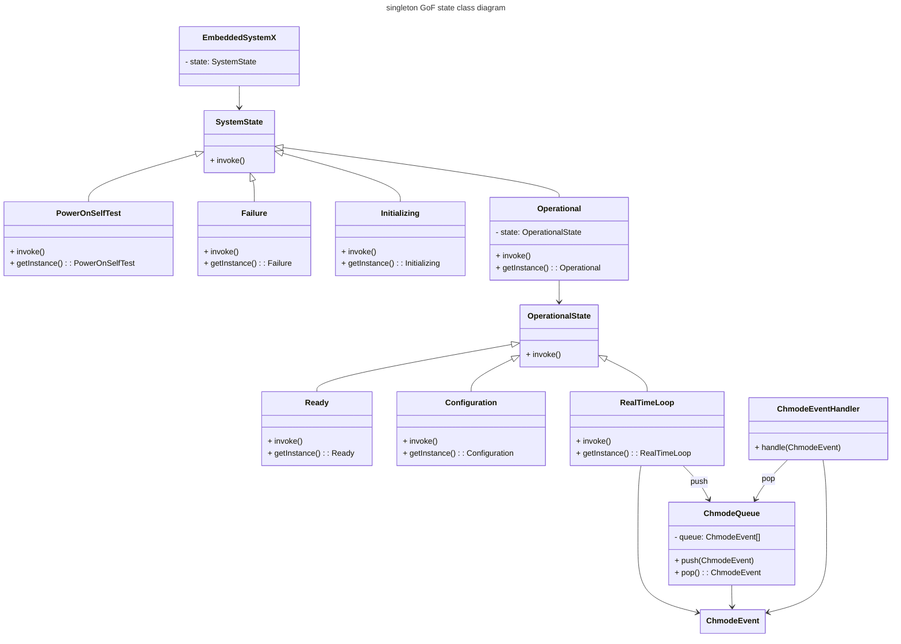

```mermaid
---
config:
  class:
    hideEmptyMembersBox: true
title: singleton GoF state  class diagram 
---
classDiagram
    class EmbeddedSystemX{
        - state: SystemState
    }

    EmbeddedSystemX --> SystemState

    class SystemState{
        + invoke()
    }

    SystemState <|-- PowerOnSelfTest
    SystemState <|-- Failure
    SystemState <|-- Initializing
    SystemState <|-- Operational

    class PowerOnSelfTest{
        + invoke()
        + getInstance(): PowerOnSelfTest
    }
    class Failure{
        + invoke()
        + getInstance(): Failure
    }
    class Initializing{
        + invoke()
        + getInstance(): Initializing
    }
    class Operational{
        - state: OperationalState
        + invoke()
        + getInstance(): Operational
    }

    Operational --> OperationalState


    class OperationalState {
        + invoke()
    }

    OperationalState <|-- Ready
    OperationalState <|-- Configuration
    OperationalState <|-- RealTimeLoop

    class Ready {
        + invoke()
        + getInstance(): Ready
    }

    class Configuration {
        + invoke()
        + getInstance(): Configuration
    }
    class RealTimeLoop {
        + invoke()
        + getInstance(): RealTimeLoop
    }


    RealTimeLoop --> ChmodeQueue : push
    RealTimeLoop --> ChmodeEvent

    class ChmodeEvent {

    }

    ChmodeQueue --> ChmodeEvent

    class ChmodeQueue {
        - queue: ChmodeEvent[]
        + push(ChmodeEvent)
        + pop(): ChmodeEvent
    }

    ChmodeEventHandler --> ChmodeEvent
    ChmodeEventHandler --> ChmodeQueue : pop
    
    class ChmodeEventHandler {
        + handle(ChmodeEvent)
    }


```
