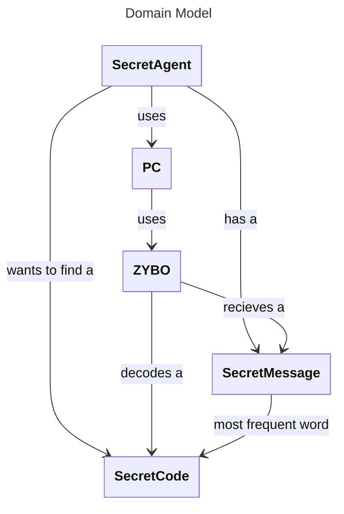
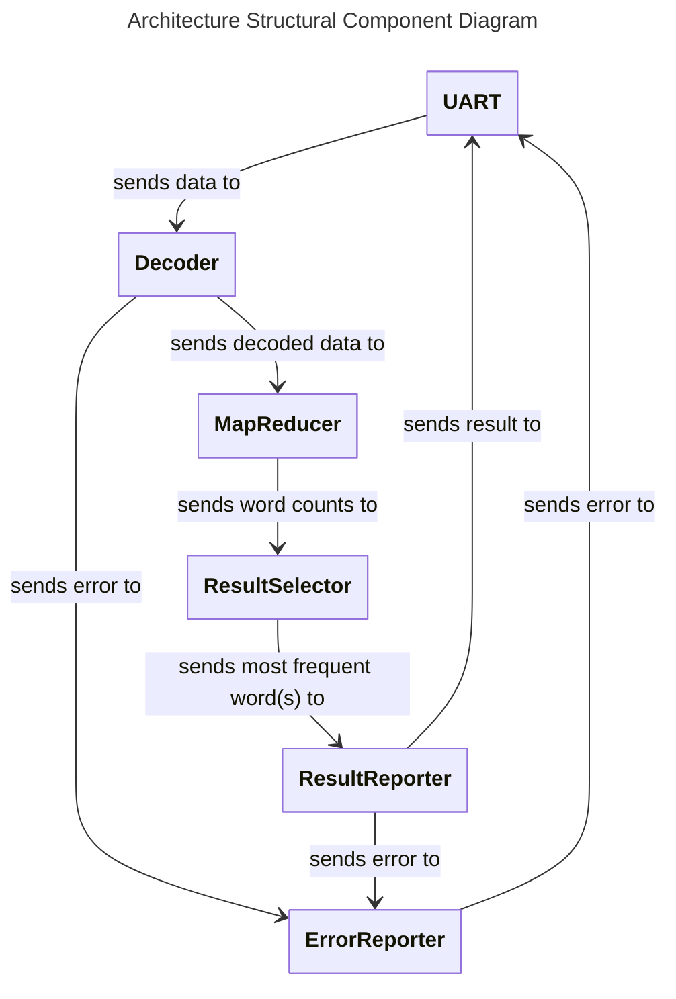
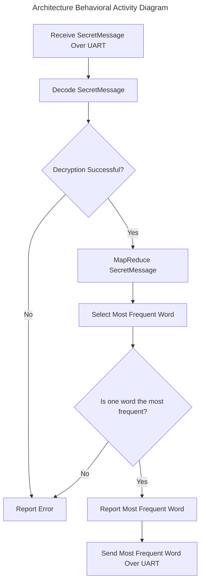
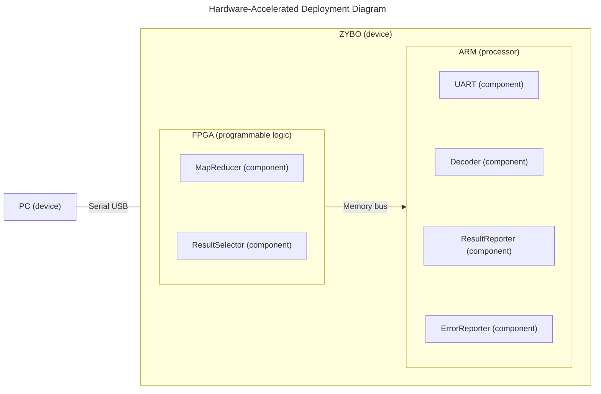
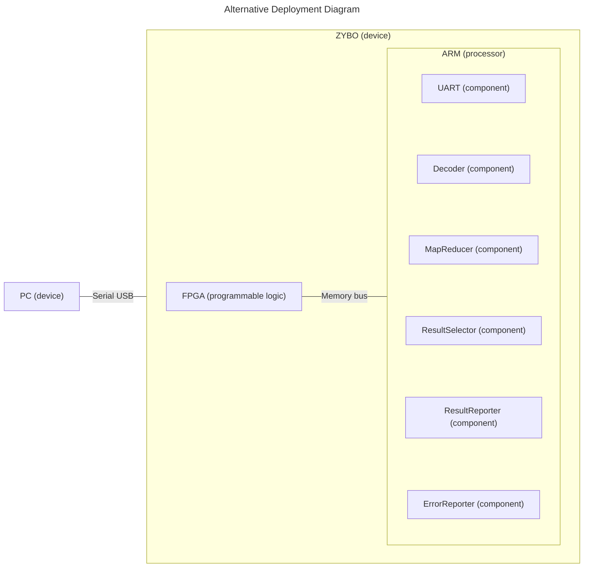
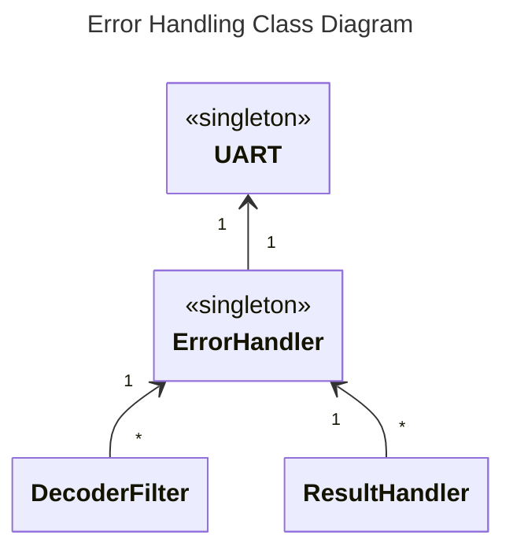
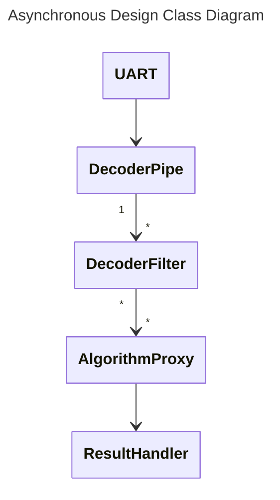
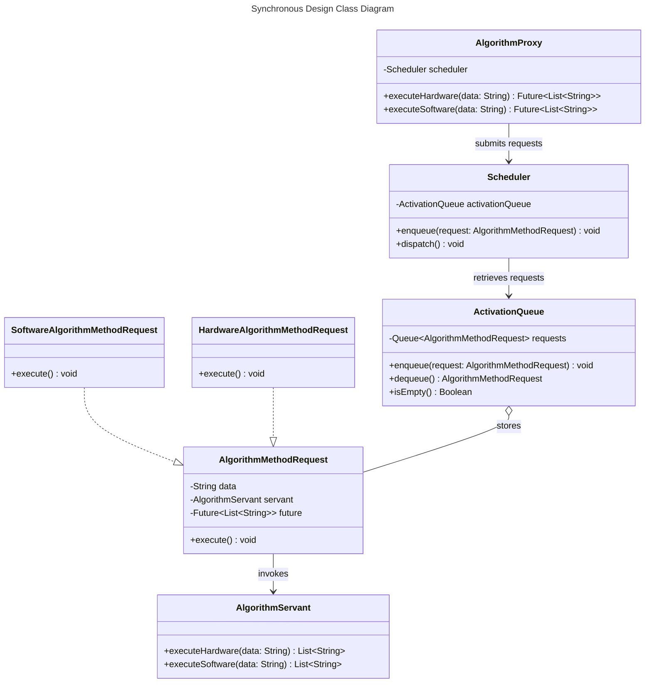

```mermaid
---
    title: Domain Model
    config:
        class:
            hideEmptyMembersBox: true
---
classDiagram
class SecretMessage
class SecretCode
class SecretAgent
class PC
class ZYBO

    SecretAgent --> SecretMessage : has a
    SecretAgent --> SecretCode : wants to find a
    SecretAgent --> PC : uses

    PC --> ZYBO : uses

    ZYBO --> SecretMessage : recieves a
    ZYBO --> SecretCode : decodes a

    SecretMessage --> SecretCode : most frequent word

```

```mermaid
---
    title: Architecture Structural Component Diagram
    config:
        class:
            hideEmptyMembersBox: true
---
classDiagram
    class UART
    class Decoder
    class MapReducer
    class ResultSelector
    class ResultReporter
    class ErrorReporter

    UART --> Decoder : sends data to
    Decoder --> MapReducer : sends decoded data to
    MapReducer --> ResultSelector : sends word counts to
    ResultSelector --> ResultReporter : sends most frequent word(s) to
    ResultReporter --> UART : sends result to
    ErrorReporter --> UART : sends error to

    Decoder --> ErrorReporter : sends error to
    ResultReporter --> ErrorReporter : sends error to

```

```mermaid
---
    title: Architecture Behavioral Activity Diagram
---
flowchart TB
    A[Receive SecretMessage Over UART] --> B[Decode SecretMessage]
    B --> C{Decryption Successful?}
    C -->|No| F[Report Error]
    C -->|Yes| G[MapReduce SecretMessage]
    G --> H[Select Most Frequent Word]
    H --> I{Is one word the most frequent?}
    I -->|No| F[Report Error]
    I -->|Yes| J[Report Most Frequent Word]
    J --> K[Send Most Frequent Word Over UART]
```

```mermaid
---
    title: Hardware-Accelerated Deployment Diagram
    config:
        flowchart:
            curve: linear
---
flowchart LR
    PC["PC (device)"]

    subgraph ZYBO["ZYBO (device)"]
        direction LR

        subgraph FPGA["FPGA (programmable logic)"]
            direction TB
            MapReducer["MapReducer (component)"]
            ResultSelector["ResultSelector (component)"]
            MapReducer ~~~ ResultSelector
        end

        subgraph ARM["ARM (processor)"]
            direction TB
            UART["UART (component)"]
            Decoder["Decoder (component)"]
            ResultReporter["ResultReporter (component)"]
            ErrorReporter["ErrorReporter (component)"]
            UART ~~~ Decoder ~~~ ResultReporter ~~~ ErrorReporter
        end

        FPGA -->|Memory bus| ARM
    end

    PC ---|Serial USB| ZYBO
```

```mermaid
---
    title: Alternative Deployment Diagram
    config:
        flowchart:
            curve: linear
---
flowchart LR
    PC["PC (device)"]

    subgraph ZYBO["ZYBO (device)"]
        direction LR
        FPGA["FPGA (programmable logic)"]

        subgraph ARM["ARM (processor)"]
            direction TB
            UART["UART (component)"]
            Decoder["Decoder (component)"]
            MapReducer["MapReducer (component)"]
            ResultSelector["ResultSelector (component)"]
            ResultReporter["ResultReporter (component)"]
            ErrorReporter["ErrorReporter (component)"]

            UART ~~~ Decoder ~~~ MapReducer ~~~ ResultSelector ~~~ ResultReporter ~~~ ErrorReporter
        end

        FPGA ---|Memory bus| ARM
    end

    PC ---|Serial USB| ZYBO
```

```mermaid
---
    title: Error Handling Class Diagram
    config:
        class:
            hideEmptyMembersBox: true  
---
classDiagram
    direction BT
    class UART {
        <<singleton>>
    }
    class ErrorHandler {
        <<singleton>>
    }
    class DecoderFilter
    class ResultHandler

    ErrorHandler "1" --> "1" UART
    DecoderFilter "*" --> "1" ErrorHandler
    ResultHandler "*" --> "1" ErrorHandler

```

```mermaid
---
    title: Asynchronous Design Class Diagram
    config:
        class:
            hideEmptyMembersBox: true
---
classDiagram
    class UART
    class DecoderPipe
    class DecoderFilter

    class AlgorithmProxy
    class ResultHandler

    UART --> DecoderPipe
    DecoderPipe "1" --> "*" DecoderFilter
    DecoderFilter "*" --> "*" AlgorithmProxy
    AlgorithmProxy --> ResultHandler

```

```mermaid
---
    title: Synchronous Design Class Diagram
    config:
        class:
            hideEmptyMembersBox: true
---

classDiagram
    direction TB
    class AlgorithmProxy {
        -Scheduler scheduler
        +executeHardware(data: String) Future~List~String~~
        +executeSoftware(data: String) Future~List~String~~
    }

    class AlgorithmServant {
        +executeHardware(data: String) List~String~
        +executeSoftware(data: String) List~String~
    }

    class Scheduler {
        -ActivationQueue activationQueue
        +enqueue(request: AlgorithmMethodRequest) void
        +dispatch() void
    }

    class ActivationQueue {
        -Queue~AlgorithmMethodRequest~ requests
        +enqueue(request: AlgorithmMethodRequest) void
        +dequeue() AlgorithmMethodRequest
        +isEmpty() Boolean
    }


    class AlgorithmMethodRequest {
        -String data
        -AlgorithmServant servant
        -Future~List~String~~ future
        +execute() void
    }

    class SoftwareAlgorithmMethodRequest {
        +execute() void
    }

    class HardwareAlgorithmMethodRequest {
        +execute() void
    }

    SoftwareAlgorithmMethodRequest ..|> AlgorithmMethodRequest
    HardwareAlgorithmMethodRequest ..|> AlgorithmMethodRequest


    AlgorithmProxy --> Scheduler : submits requests
    Scheduler --> ActivationQueue : retrieves requests
    ActivationQueue o-- AlgorithmMethodRequest : stores
    AlgorithmMethodRequest --> AlgorithmServant : invokes
```
