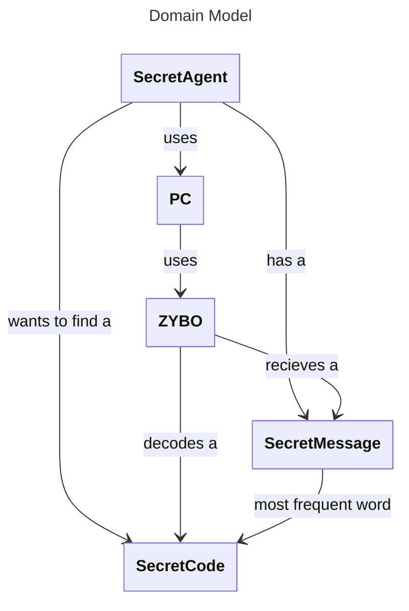
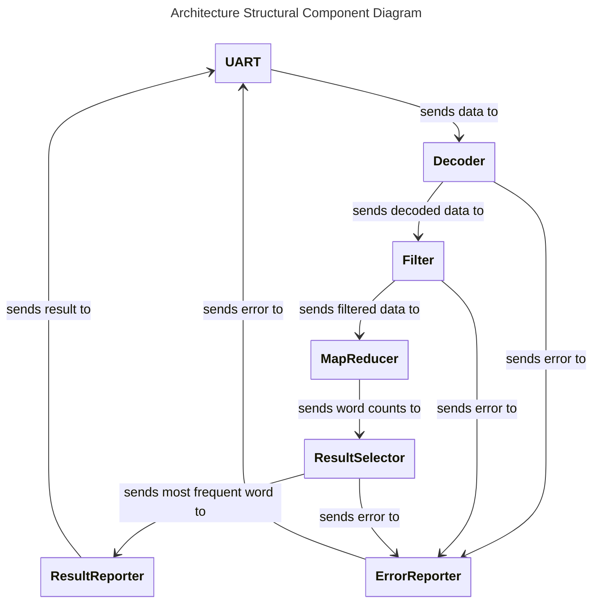
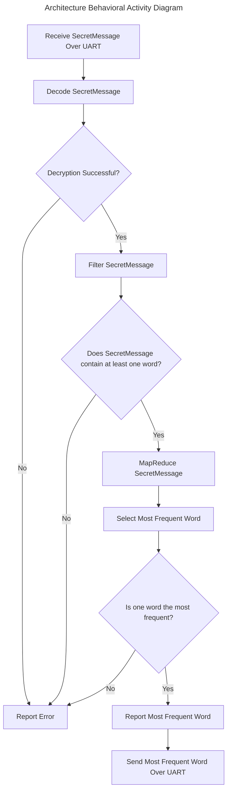

```mermaid
---
    title: Domain Model
    config:
        class:
            hideEmptyMembersBox: true
---
classDiagram
class SecretMessage
class SecretCode
class SecretAgent
class PC
class ZYBO

    SecretAgent --> SecretMessage : has a
    SecretAgent --> SecretCode : wants to find a 
    SecretAgent --> PC : uses

    PC --> ZYBO : uses

    ZYBO --> SecretMessage : recieves a
    ZYBO --> SecretCode : decodes a

    SecretMessage --> SecretCode : most frequent word

```

```mermaid
---
    title: Architecture Structural Component Diagram
    config:
        class:
            hideEmptyMembersBox: true
---
classDiagram
    class UART
    class Decoder
    class Filter
    class MapReducer
    class ResultSelector
    class ResultReporter
    class ErrorReporter

    UART --> Decoder : sends data to
    Decoder --> Filter : sends decoded data to
    Filter --> MapReducer : sends filtered data to
    MapReducer --> ResultSelector : sends word counts to
    ResultSelector --> ResultReporter : sends most frequent word to
    ResultReporter --> UART : sends result to
    ErrorReporter --> UART : sends error to

    Decoder --> ErrorReporter : sends error to
    Filter --> ErrorReporter : sends error to
    ResultSelector --> ErrorReporter : sends error to

```

```mermaid
---
    title: Architecture Behavioral Activity Diagram
---
flowchart TB
    A[Receive SecretMessage Over UART] --> B[Decode SecretMessage]
    B --> C{Decryption Successful?}
    C -->|No| F[Report Error]
    C -->|Yes| D[Filter SecretMessage]
    D --> E{Does SecretMessage contain at least one word?}
    E -->|No| F[Report Error]
    E -->|Yes| G[MapReduce SecretMessage]
    G --> H[Select Most Frequent Word]
    H --> I{Is one word the most frequent?}
    I -->|No| F[Report Error]
    I -->|Yes| J[Report Most Frequent Word]
    J --> K[Send Most Frequent Word Over UART]
```
